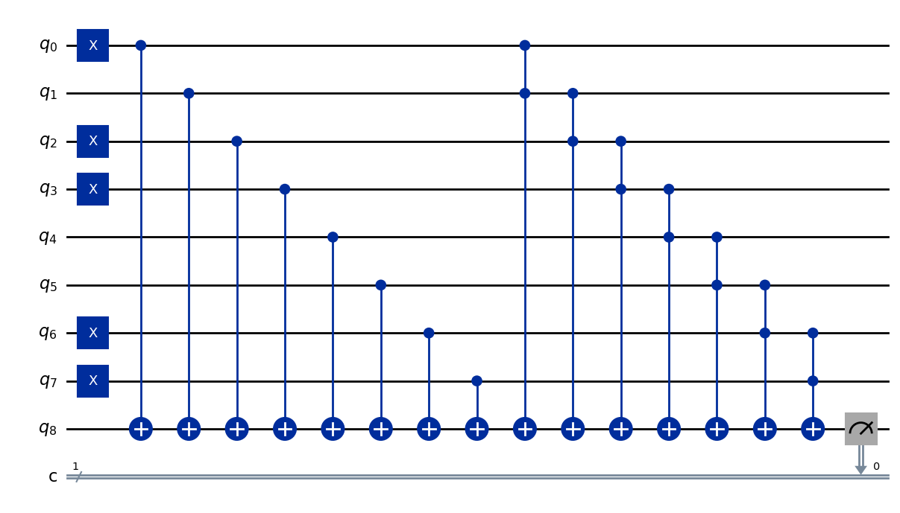

# Quantum Solutions

## Qiskit
[Medium post explaining the solution](https://medium.com/@kauemiziara/eight-trees-problem-2-c74764013cc6)

```python
def eight_trees(trees: list) -> int:
    n = len(trees)
    qc = QuantumCircuit(n+1, 1)
    [qc.x(i) for i in range(n) if trees[i]]

    [qc.cx(i, n) for i in range(n)]
    [qc.ccx(i, i+1, n) for i in range(n - 1)]

    qc.measure(n, 0)

    backend = AerSimulator()
    result = backend.run(qc, shots = 1).result().get_counts()

    output = list(result.keys())[0]
    return int(output)
```

## Example
```python
eight_trees([1, 0, 1, 1, 0, 0, 1, 1])
``` 
```bash
# Output
1
# Output image:
```


